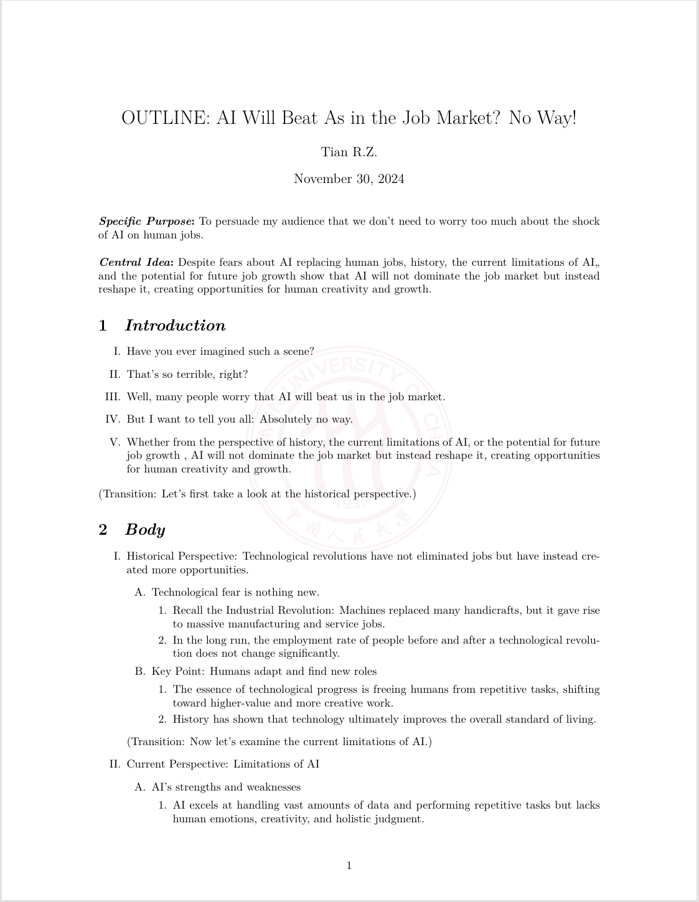
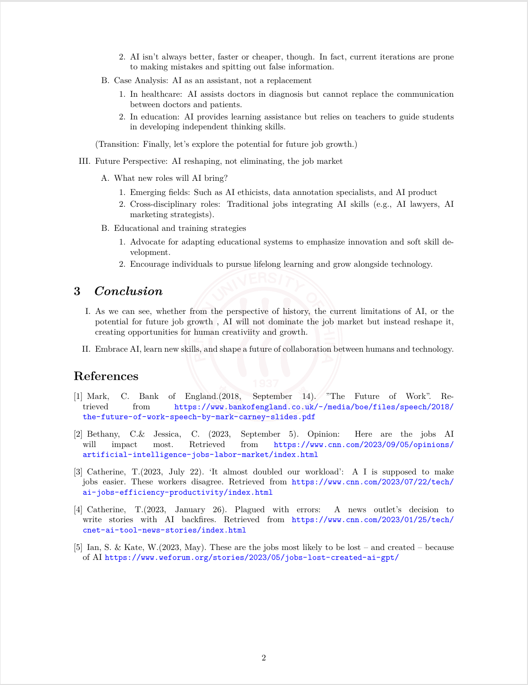

# English Article

这是一个用于编写简易英语文稿的 $\LaTeX$ 模板，包含了一些常用的设置和示例代码，帮助你快速开始使用 LaTeX 编写英语文稿。

## 特性

- 支持英文和特殊字体
- 包含常用的公式和符号
- 提供了多种环境：摘要、章节目录、多级列表、参考文献
- 支持插入背景图（如校徽Logo）
- 自定义列表格式
- 自定义封面和标题页

## 示例

以下是一个简单的示例，展示了如何使用本模板编写一个英语演讲大纲：

```latex
\documentclass{article}
\usepackage[english]{babel}
\setlength{\parindent}{0pt}

% Set page size and margins
% Replace `letterpaper' with`a4paper' for UK/EU standard size
\usepackage[letterpaper,top=2cm,bottom=2cm,left=3cm,right=3cm,marginparwidth=1.75cm]{geometry}

% Useful packages
\usepackage{amsmath}
\usepackage{graphicx}
\usepackage[colorlinks=true, allcolors=blue]{hyperref}
\usepackage{background}
\backgroundsetup{scale=0.3, angle=0, opacity = 1,contents = {\includegraphics[width=\paperwidth, height=\paperwidth, keepaspectratio]{logo-RUC.png}}}

\title{OUTLINE: AI Will Beat As in the Job Market? No Way!}
\author{Tian R.Z.}
```
初始化部分支持自定义文档名称、日期

```latex
\begin{document}
\maketitle

%\begin{abstract}
%     Your abstract.
%\end{abstract}
\textbf{\textit{Specific Purpose}:}~To persuade my audience that we 
don’t need to worry too much about the shock of AI on human jobs.\newline

\textbf{\textit{Central Idea}:}~Despite fears about AI 
replacing human jobs, history, the current limitations of AI,, 
and the potential for future job growth show that AI will
 not dominate the job market but instead reshape it, creating 
 opportunities for human creativity and growth.

\section{\textit{Introduction}}
\begin{enumerate}
      \renewcommand{\labelenumi}{\Roman{enumi}.}  % 外层使用大写罗马数字
      \item Have you ever imagined such a scene? 
      \item That's so terrible, right? 
      \item Well, many people worry that AI will beat 
      us in the job market.
      \item But I want to tell you all: Absolutely no way.
      \item Whether from the perspective of history,
       the current limitations of AI, or the potential for future job growth
       , AI will not dominate the job market but instead reshape it, creating 
       opportunities for human creativity and growth.
\end{enumerate}
(Transition: Let's first take a look at the historical perspective.)
\section{\textit{Body}}
\begin{enumerate}
      \renewcommand{\labelenumi}{\Roman{enumi}.} 
      \item Historical Perspective: Technological revolutions 
      have not eliminated jobs but have instead created more opportunities.
      \begin{enumerate}
            \item[A.] Technological fear is nothing new.
            \begin{enumerate}
                  \item[1.] Recall the Industrial Revolution: 
                  Machines replaced many handicrafts, but it gave rise 
                  to massive manufacturing and service jobs.
                  \item[2.] In the long run, the employment rate of people 
                  before and after a technological revolution does not change
                   significantly.
            \end{enumerate}
            \item[B.]  Key Point: Humans adapt and find new roles
            \begin{enumerate}
                  \item[1.] The essence of technological progress is 
                  freeing humans from repetitive tasks, shifting toward 
                  higher-value and more creative work.
                  \item[2.] History has shown that technology ultimately 
                  improves the overall standard of living. 
            \end{enumerate}
      \end{enumerate}
      (Transition: Now let's examine the current limitations of AI.)
      \item Current Perspective: Limitations of AI
      \begin{enumerate}
            \item[A.] AI's strengths and weaknesses
            \begin{enumerate}
                  \item[1.] AI excels at handling vast amounts of 
                  data and performing repetitive tasks but lacks human 
                  emotions, creativity, and holistic judgment. 
                  \item[2.] AI isn’t always better, faster or cheaper,
                   though. In fact, current iterations are prone to making 
                   mistakes and spitting out false information.
            \end{enumerate}
            \item[B.] Case Analysis: AI as an assistant, not a replacement
            \begin{enumerate}
                  \item[1.] In healthcare: AI assists doctors in diagnosis
                   but cannot replace the communication between doctors and 
                   patients.
                  \item[2.] In education: AI provides learning assistance 
                  but relies on teachers to guide students in developing 
                  independent thinking skills. 
            \end{enumerate}
      \end{enumerate}
      (Transition: Finally, let's explore the potential for future job growth.)
      \item Future Perspective: AI reshaping, not eliminating, the job market
      \begin{enumerate}
            \item [A.] What new roles will AI bring?
            \begin{enumerate}
                  \item [1.] Emerging fields: Such as AI ethicists, data 
                  annotation specialists, and AI product
                  \item [2.] Cross-disciplinary roles: Traditional jobs 
                  integrating AI skills (e.g., AI lawyers, AI marketing 
                  strategists).
            \end{enumerate}
            \item [B.] Educational and training strategies
            \begin{enumerate}
                  \item [1.]  Advocate for adapting educational 
                  systems to emphasize innovation and soft skill development.
                  \item [2.]  Encourage individuals to pursue lifelong 
                  learning and grow alongside technology.
            \end{enumerate}
      \end{enumerate}
\end{enumerate}
\section{\textit{Conclusion}}
\begin{enumerate}
      \renewcommand{\labelenumi}{\Roman{enumi}.}
      \item As we can see, whether from the perspective of history,
       the current limitations of AI, or the potential for future
      job growth , AI will not dominate the job market but instead 
      reshape it, creating opportunities for human creativiity and growth.
      \item Embrace AI, learn new skills, and shape a future of 
      collaboration between humans and technology.
\end{enumerate}

\begin{thebibliography}{}

\bibitem{技术革命与就业率}
Mark, C. Bank of England.(2018, September 14). "The Future of Work".
Retrieved from \url{https://www.bankofengland.co.uk/-/media/boe/files/speech/2018/the-future-of-work-speech-by-mark-carney-slides.pdf}

\bibitem{AI同理心}
Bethany, C.\& Jessica, C. (2023, September 5). Opinion: Here are the jobs AI will impact most. 
Retrieved from \url{https://www.cnn.com/2023/09/05/opinions/artificial-intelligence-jobs-labor-market/index.html}

\bibitem{AI不一定更好}
Catherine, T.(2023, July 22). ‘It almost doubled our workload’: A
I is supposed to make jobs easier. These workers disagree. 
Retrieved from \url{https://www.cnn.com/2023/07/22/tech/ai-jobs-efficiency-productivity/index.html}

\bibitem{AI不一定更好} 
Catherine, T.(2023, January 26). Plagued with errors: 
A news outlet’s decision to write stories with AI backfires. 
Retrieved from \url{https://www.cnn.com/2023/01/25/tech/cnet-ai-tool-news-stories/index.html}

\bibitem{AI新增就业}
Ian, S. \& Kate, W.(2023, May). These are the jobs most likely to be lost – and created – because of AI 
\url{https://www.weforum.org/stories/2023/05/jobs-lost-created-ai-gpt/}

\end{thebibliography}

\end{document}
```
效果如下：




