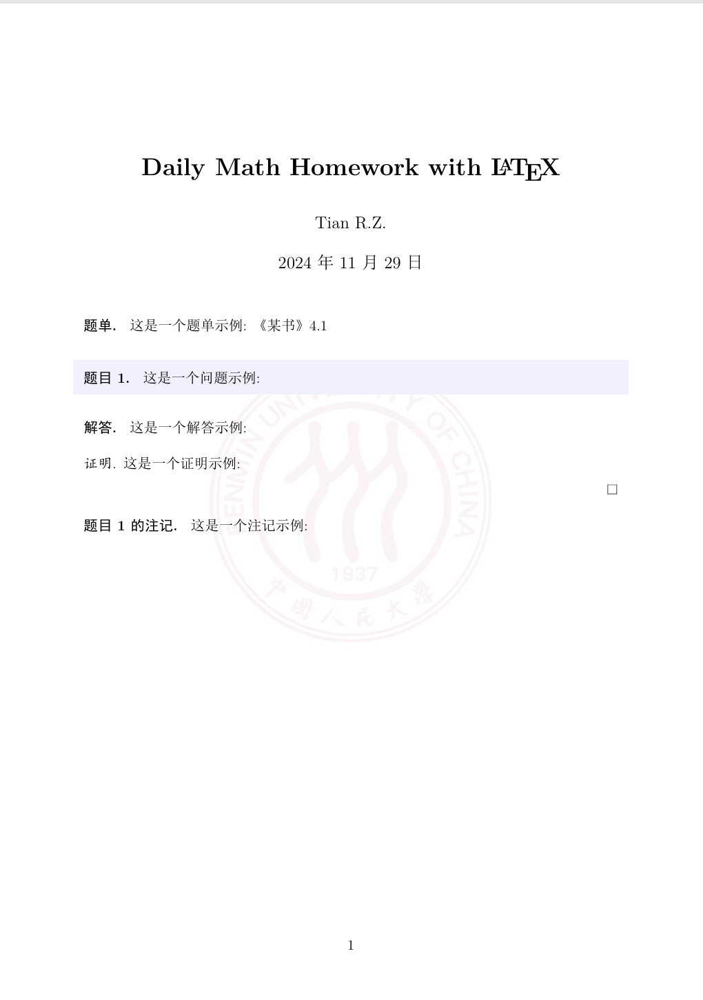

# Math Homework

这是一个用于编写数学作业的 LaTeX 模板仓库，包含了一些常用的设置和示例代码，帮助你快速开始使用 LaTeX 编写数学作业。

## 特性

- 支持中文和英文
- 包含常用的数学公式和符号
- 提供了多种环境，如题单、题目、证明、注记等
- 支持插入背景图（如校徽Logo）
- 支持插入图片和表格
- 自定义封面和标题页

## 示例

以下是一个简单的示例，展示了如何使用本模板编写一个包含数学公式和图片的作业：

```latex
\documentclass[12pt, a4paper, oneside]{ctexart}
\usepackage{amsmath, amsthm, amssymb, bm, color, framed, graphicx, hyperref, mathrsfs,extarrows}
\title{\textbf{Daily Math Homework Template}}
\author{XXX-Student ID}
\date{Time} % 输入\today以显示当日日期
\linespread{1.5}
\definecolor{shadecolor}{RGB}{241, 241, 255} %可以选择自己喜欢的颜色
\newcounter{problemname}

% 这一部分可以设置自己需要的模块
\newenvironment{problem}{\begin{shaded}\stepcounter{problemname}\par\noindent\textbf{题目\arabic{problemname}. }}{\end{shaded}\par}
\newenvironment{solution}{\par\noindent\textbf{解答. }}{\par}
\newenvironment{note}{\par\noindent\textbf{题目\arabic{problemname}的注记. }}{\par}
\newenvironment{ProblemList}{\par\noindent\textbf{题单. }}{\par}

% 设置文档的背景,显示背景请编译两次
\usepackage{background}
\backgroundsetup{scale=0.6, angle=0, opacity = 1,contents = {\includegraphics[width=\paperwidth, height=\paperwidth, keepaspectratio]{logo-RUC.png}}}
```
初始化部分支持自定义文档名称、日期、并设置自己所需要的模块和文档背景。
```latex
\begin{document}

\maketitle
\begin{ProblemList}
    这是一个题单示例: 《某书》4.1
\end{ProblemList}

\begin{problem}
    这是一个问题示例:
\end{problem}

\begin{solution}
    这是一个解答示例:
\end{solution}

\begin{proof}
    这是一个证明示例:

\end{proof}

\begin{note}
    这是一个注记示例:
\end{note}
```
预览：



