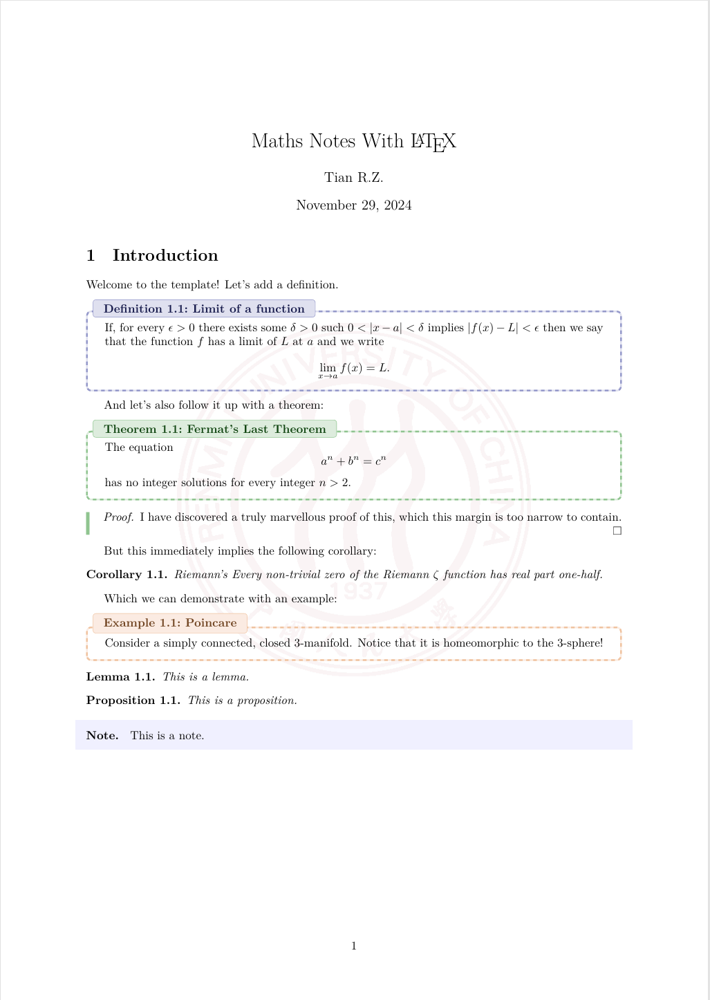

# Math Note

这是一个用于编写数学笔记的 LaTeX 模板，包含了一些常用的设置和示例代码，帮助你快速开始使用 LaTeX 编写数学笔记。

## 特性

- 支持中文和英文
- 包含常用的数学公式和符号
- 提供了多种环境：定理、引理、定义、推论、例题、命题、证明和注记
- 支持插入背景图（如校徽Logo）
- 支持插入Tiz绘图
- 自定义封面和标题页

## 示例

以下是一个简单的示例，展示了如何使用本模板编写一个包含数学公式和图片的作业：

```latex
% This is the main file for the document. It contains the preamble and the document body.，
% The preamble contains the document class, the title, the author, and any packages that are needed.
% 如果需要中文支持,请将 \documentclass{MathNote} 替换为 \documentclass{MathNoteCN}
% 为显示背景请连续编译两遍

\documentclass{MathNote}

\title{Maths Notes With \LaTeX}
\author{Tian R.Z.}
```
初始化部分支持自定义文档名称、日期、通过更改cls文件还可以进一步设置中英文支持和以及实现更加复杂的功能。

```latex
\begin{document}
	\maketitle
	\section{Introduction}
	Welcome to the template! Let's add a definition.
	\begin{definition}{Limit of a function}{}
	If, for every $ \epsilon >0 $ there exists some $ \delta >0 $ such $ 0<|x-a|<\delta $ implies $ |f(x)-L|<\epsilon $ then we say that the function $ f $ has a limit of $ L $ at $ a $ and we write
	\[\lim_{x\to a}f(x)=L.\]
	\end{definition}
	And let's also follow it up with a theorem:
	\begin{theorem}{Fermat's Last Theorem}{}
		The equation
		\[a^n+b^n=c^n\]
		has no integer solutions for every integer $ n> 2 $.
	\end{theorem}
	\begin{proof}
		I have discovered a truly marvellous proof of this, which this margin is too narrow to contain.
	\end{proof}
	But this immediately implies the following corollary:
	\begin{corollary}{Riemann's}{}
		Every non-trivial zero of the Riemann $ \zeta $ function has real part one-half.
	\end{corollary}
	Which we can demonstrate with an example:
	\begin{example}{Poincare}{}
		Consider a simply connected, closed 3-manifold. Notice that it is homeomorphic to the 3-sphere!
	\end{example}
	\begin{lemma}
		This is a lemma.
	\end{lemma}
	\begin{proposition}
		This is a proposition.
	\end{proposition}
	\begin{note}
		This is a note.
	\end{note}
\end{document}
```
效果如下：



