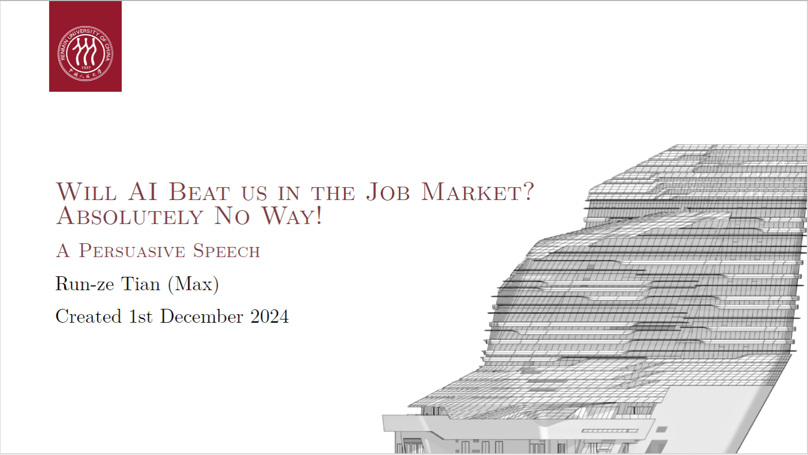
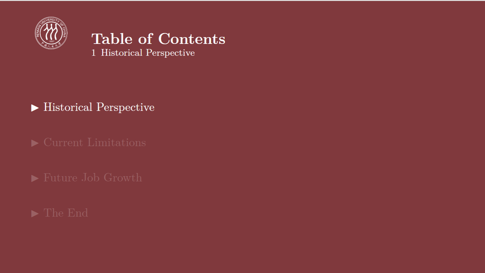
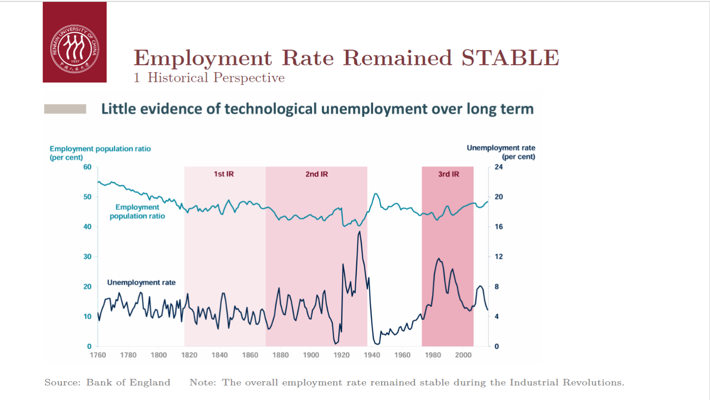
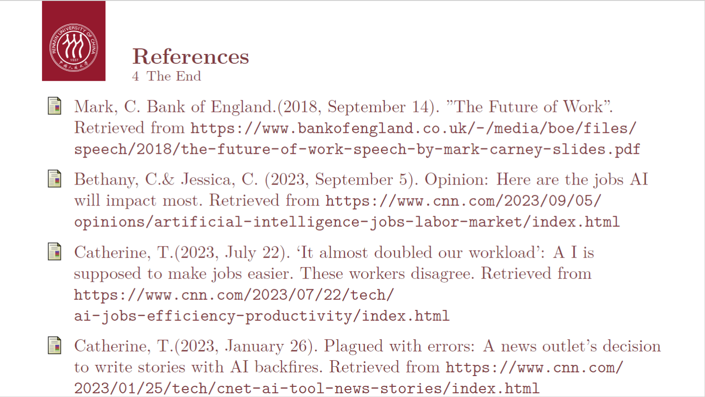

# Presentation Slide

这是一个用于日常Presentation的 $\LaTeX$ 模板，包含了一些常用的设置和示例代码，帮助你快速开始使用 Beamer 编写。

## 特性

- 支持中文和英文
- 包含常用的数学公式和符号
- 支持插入背景图（如校徽Logo）
- 支持自定义校徽
- 支持插入Tiz绘图

## 示例

以下是一个简单的示例，展示了如何使用本模板编写一个美观的Slide (使用时注意将文件夹下子文件置于同一目录下)：

```latex
\documentclass{beamer}
\usepackage[ruc,en]{collegeBeamer}

\definecolor{hrefcol}{RGB}{0, 0, 255} % Example: blue color

% meta-data
\title{Will AI Beat us in the Job Market?\\Absolutely No Way!}
\subtitle{A Persuasive Speech}
\author{\href{mailto:trunzer@ruc.edu.cn}{Run-ze Tian (Max)}}
\date{Created 1st December 2024}

% 为显示目录请连续编译两遍
```
```latex
\begin{document}

    \maketitle

    \begin{frame}
        \begin{abstract}
            \qquad Many people worry that AI will beat us in the job market, but \textbf{\textcolor{structure}{ from 
                        the perspective of history, the current limitations of AI, and the
                        potential for future job growth}}, AI will not dominate the job market
                        but instead \textbf{\textcolor{structure}{\large reshape}} it, creating opportunities for human creativity
                        and growth.
        \end{abstract}
    \end{frame}

    \section{Historical Perspective}

    \begin{frame}{Employment Rate Remained STABLE}{\thesection \, \secname}
        \includegraphics[width=0.8\textwidth]{失业率.png}

        \renewcommand{\footnoterule}
        \footnotetext{\textcolor{gray}{\tiny Source: Bank of England\qquad Note: The overall employment rate remained stable during the Industrial Revolutions.}}
    \end{frame}

    \begin{frame}{Living Standards Raised}{\thesection \, \secname}
       \begin{columns}
            \begin{column}{0.3\textwidth}
                \begin{itemize}
                    \item Increase productivity
                    \item Increase Real wage
                \end{itemize}
            \end{column}
            \begin{column}{0.7\textwidth}
                \includegraphics[width=\textwidth]{收入提高.png}\newline
                \renewcommand{\footnoterule}
            \footnotetext{\textcolor{gray}{\tiny Source: Bank of England.  Note:  series are ten year moving averages.}}
            \end{column}
        \end{columns}
    \end{frame}

    \section{Current Limitations}

    \begin{frame}[fragile]{Shortage of Emotional Intelligence and Stability} 
        \begin{center}
            \textbf{\Large AI may excel in certain areas, 
            but its current limitations ensure that it serves
             as a tool to \textcolor{structure}{assist humans, not replace them.}}
        \end{center}
        \begin{columns}
        \begin{column}{0.5\textwidth}
            \begin{enumerate}
                \item[-] \textbf{\textcolor{structure}{\large Lack of EI:}}\newline
                \begin{enumerate}
                    \item[A)] AI cannot truly empathize or be emotionally anticipatory
                    \item[B)] AI cannot make decisions considering human emotions
                \end{enumerate} 
            \end{enumerate}
        \end{column}
        \begin{column}{0.5\textwidth}
        \begin{enumerate}
            \item[-] \textbf{\textcolor{structure}{\large Not Always Right}}\newline 
            \begin{enumerate}
                \item[A)] CNET had to issue several corrections after using AI 
                \item[B)] IAMAW  workload increased
                for implementing new AI tools
            \end{enumerate}
        \end{enumerate}
        \end{column}
        \end{columns}
    \end{frame}
    \section{Future Job Growth}

    \begin{frame}
        \frametitle{Future Job Growth}
        \begin{columns}
            \begin{column}{0.5\textwidth}
                \includegraphics[width=0.85\textwidth]{ai_impact_on_jobs_pie.png}
                
                More companies expect jobs growth.
            \end{column}
            \begin{column}{0.5\textwidth}
                \includegraphics[width=0.85\textwidth]{ai_linked_roles_growth.png}
                AI-linked roles are expected to swell
            \end{column}
        \end{columns}
    \end{frame}

    \section{The End}

    \begin{frame}
        \frametitle{Conclusion}
            \begin{quote}
                \textbf{ AI will not replace us but \textcolor{structure}{\large reshape how
                        we work}. It is a catalyst for progress, pushing us toward more creative,
                        meaningful, and higher-value work.}        
                        \newline
                        \begin{center}
                        \textbf{\textcolor{structure}{\Large Let us embrace its potential to enhance our lives and career!}}
                \end{center}
            \end{quote}   
    \end{frame}

    \begin{frame}
        \frametitle{References}
        \begin{thebibliography}{}

            \bibitem{技术革命与就业率}
            Mark, C. Bank of England.(2018, September 14). "The Future of Work".
            Retrieved from \url{https://www.bankofengland.co.uk/-/media/boe/files/speech/2018/the-future-of-work-speech-by-mark-carney-slides.pdf}
            
            \bibitem{AI同理心}
            Bethany, C.\& Jessica, C. (2023, September 5). Opinion: Here are the jobs AI will impact most. 
            Retrieved from \url{https://www.cnn.com/2023/09/05/opinions/artificial-intelligence-jobs-labor-market/index.html}
            
            \bibitem{AI不一定更好}
            Catherine, T.(2023, July 22). ‘It almost doubled our workload’: A
            I is supposed to make jobs easier. These workers disagree. 
            Retrieved from \url{https://www.cnn.com/2023/07/22/tech/ai-jobs-efficiency-productivity/index.html}
            
            \bibitem{AI不一定更好} 
            Catherine, T.(2023, January 26). Plagued with errors: 
            A news outlet’s decision to write stories with AI backfires. 
            Retrieved from \url{https://www.cnn.com/2023/01/25/tech/cnet-ai-tool-news-stories/index.html}
            \end{thebibliography}
    \end{frame}
    \begin{frame}
        \frametitle{References}
    \begin{thebibliography}{}   
        \bibitem{AI新增就业}
        Ian, S. \& Kate, W.(2023, May). These are the jobs most likely to be lost – and created – because of AI \url{https://www.weforum.org/stories/2023/05/jobs-lost-created-ai-gpt/}
        
        \end{thebibliography}
    \end{frame}
            
    %\bibliographpage

    \QApage

\end{document}
```
效果如下：





