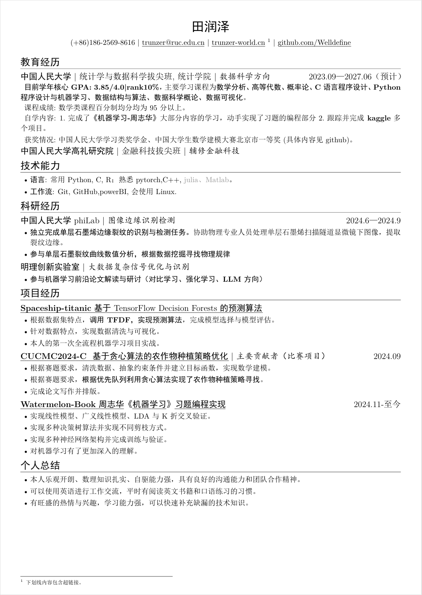

# Resume
这是一个用于编写个人项目简历的 $\LaTeX$ 模板，包含了一些常用的设置和示例代码，旨在实现最佳的信息密度和美学吸引力。

    

## 特性

- 支持中文和英文
- 包含教育经历、技术能力、科研经历、项目经历和个人总结等多个核心模块
- 通过调整排版提高简历的信息密度。
- 支持生成 PDF 书签。
- 精简依赖，不默认引入其他字体，不默认引入图标。
- 提供超链接、脚注、非重点内容的排版示例。
- (🖼️)支持插入照片（请看代码注释）。

## 使用方法

### 本地编译

0. 确保已经安装 LaTeX 发行版。
1. **克隆或下载**本项目代码。
2. 直接运行 `latexmk` 即可。

## 宏

常用用法可参考 `main.tex` 中的示例内容。

- `\ResumeName{}` 定义简历标题（一般是姓名）。
- `\ResumeContact{}` 添加一个联系方式。
- `\ResumeContacts{itemA, itemB, itemC}` 添加多个联系方式。
- `\ResumeTitle` 渲染标题和联系方式。
- `\section{}` 节标题。
- `\ResumeItem[]{}[][]`
  1. 可选参数，控制 PDF 书签内容。如果不提供则采用参数 2。
  2. 项标题，左对齐。
  3. 可选参数，补充信息，在参数 2 后显示。
  4. 可选参数，右对齐。
- `\GrayText{}` 改变文字内容为灰色。
- `\ResumeUrl{}{}` 带有下划线的 `\href` 命令，与 `\href` 用法相同。

> `[]` 为可选参数， `{}` 为必需参数。

## 包依赖

**如果你使用 TeXLive/MiKTeX 等主流发行版，可以直接使用本项目，无需手动安装依赖。**

## 有用的相关资源

- [Resume Improvement](https://intdouble.com/resume/)
- GPTs

## 致谢

该项目主要受到 [fky2015/resume-ng](https://github.com/fky2015/resume-ng) 的启发，
并基于“提高一页简历中的信息密度”这一排版思路而进一步改进。